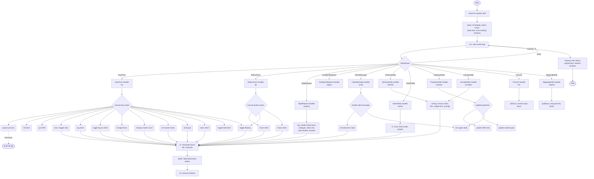

<div align="center">

# nwm

**Minimal tiling X11 window manager. ~1000 lines. No config files. No runtime dependencies.**


</div>

<p align="center">
  
  
  
  
  
  
  
</p>

## Contents

- [Quick Start](#quick-start)
- [vs dwm](#vs-dwm)
- [Features](#features)
- [Screenshots](#screenshots)
- [Installation](#installation)
- [Usage](#usage)
- [Key Bindings](#key-bindings)
- [Configuration](#configuration)
- [How It Works](#how-it-works)
- [Contributing](#contributing)
- [Star History](#star-history)
- [Related](#related)
- [License](#license)

---

## Quick Start

```sh
git clone https://github.com/tinyopsec/nwm
cd nwm
make && sudo make install
echo "exec nwm" >> ~/.xinitrc
startx
```

> [!NOTE]
> The default terminal is `st` and the default launcher is `dmenu_run`. Change them in `nwm.h` before compiling if you use something else (see [Configuration](#configuration)).

For display managers, place a session file at `/usr/share/xsessions/nwm.desktop` (see [Usage](#usage)).

---

## vs dwm

`nwm` takes direct inspiration from dwm but diverges in a few concrete ways:

| Area | dwm | nwm |
|---|---|---|
| Lines of code | ~2000 | ~900 - fits in one reading session |
| RAM at idle | ~2-3 MB | ~1 MB - leaner process image |
| Tiling arithmetic | Can accumulate pixel remainder | Integer division, no drift |
| Gap support | Requires patching | Built in via `gappx` |
| `Mod+Tab` behavior | Inconsistent across patches | Deterministic XOR for both tags and layouts |
| OpenBSD `pledge(2)` | Not supported | Supported natively |
| POSIX compliance | Uses GNU extensions in places | Strict POSIX C99 throughout |
| Status bar | Built-in bar, requires patching to remove | No bar - use any external panel or none |
| Config complexity | ~100 lines of config + patch management | Single flat `nwm.h`, no patch stack |
| Audit surface | Large - bar, fonts, drawing code | Minimal - window management only |

dwm's bar and font rendering alone account for a significant portion of its codebase. `nwm` drops all of that. No drawing, no text, no color schemes beyond three border hex values.

If you already run a patched dwm, `nwm` is roughly what you end up with after applying the gaps and pertag patches - except the behavior is defined once, not assembled from diffs.

---

## Features

| Category | Details |
|---|---|
| Layouts | Tiling (master/stack), floating, monocle |
| Workspaces | 9 tags via bitmasks; windows may carry multiple tags |
| Mouse support | Move, resize, toggle floating via modifier + button |
| Gaps | Configurable `gappx` on all sides |
| Borders | Inactive, focused, and urgent colors at compile time |
| Fullscreen | Toggle via keybind or `_NET_WM_STATE_FULLSCREEN` |
| Urgent hints | `XUrgencyHint` and `_NET_ACTIVE_WINDOW` handled |
| Auto-float | `_NET_WM_WINDOW_TYPE_DIALOG` windows float automatically |
| EWMH | `_NET_WM_STATE`, `_NET_ACTIVE_WINDOW`, `_NET_CLIENT_LIST`, `_NET_SUPPORTING_WM_CHECK` |
| ICCCM | `WM_DELETE_WINDOW`, `WM_TAKE_FOCUS`, `WM_NORMAL_HINTS`, `WM_HINTS` |
| OpenBSD | `pledge(2)` support; also builds on FreeBSD |
| Compilation | Clean under `gcc -std=c99 -pedantic -Wall -Wextra` |

---

## Screenshots


---

## Installation

### Requirements

| Dependency | Arch | Debian / Ubuntu | Void | Alpine |
|---|---|---|---|---|
| Xlib | `libx11` | `libx11-dev` | `libX11-devel` | `libx11-dev` |
| C compiler | `gcc` or `clang` | `build-essential` | `gcc` | `build-base` |

No runtime dependencies beyond Xlib.

### From Source

```sh
git clone --depth 1 https://github.com/tinyopsec/nwm
cd nwm
make
sudo make install   # installs to /usr/local/bin/nwm
```

Change `PREFIX` in the `Makefile` to install elsewhere.

### AUR (Arch Linux)

```sh
yay -S nwm
```

Package: [aur.archlinux.org/packages/nwm](https://aur.archlinux.org/packages/nwm)

<details>
<summary>FreeBSD / OpenBSD / NetBSD / DragonFly</summary>

Install Xlib via the system package manager, then edit the top of the `Makefile` to point at your system's X11 paths. The relevant lines are already present but commented out:

```makefile
# Uncomment for OpenBSD / FreeBSD:
# INCS = -I/usr/X11R6/include
# LIBS = -L/usr/X11R6/lib -lX11
```

Then build normally:

```sh
make && sudo make install
```

`nwm` uses `pledge(2)` on OpenBSD automatically - no extra steps needed.

</details>

### Uninstall

```sh
sudo make uninstall
```

---

## Usage

### Starting nwm

Add to `~/.xinitrc`:

```sh
picom &
feh --bg-scale ~/wallpaper.png &
exec nwm
```

`nwm` has no built-in autostart. Launch background processes from `.xinitrc` or a wrapper script before the `exec` line.

For display managers:

```ini
# /usr/share/xsessions/nwm.desktop
[Desktop Entry]
Name=nwm
Comment=Minimal tiling X11 window manager
Exec=nwm
Type=Application
```

### Terminal and Launcher

Defaults in `nwm.h`:

```c
static const char *termcmd[]  = { "st", NULL };
static const char *dmenucmd[] = { "dmenu_run", NULL };
```

To use `alacritty` and `rofi`:

```c
static const char *termcmd[]  = { "alacritty", NULL };
static const char *dmenucmd[] = { "rofi", "-show", "run", NULL };
```

> [!IMPORTANT]
> Recompile after any change to `nwm.h`: `make && sudo make install`

---

## Key Bindings

The default modifier is **Super (Win)**. To use Alt instead, change `#define MODKEY Mod4Mask` to `Mod1Mask` in `nwm.h`.

### Windows and Layouts

| Key | Action |
|---|---|
| `Mod + Return` | Spawn terminal |
| `Mod + d` | Spawn launcher (dmenu) |
| `Mod + j` | Focus next window in stack |
| `Mod + k` | Focus previous window in stack |
| `Mod + h` | Shrink master area by 5% |
| `Mod + l` | Grow master area by 5% |
| `Mod + i` | Increase master window count |
| `Mod + o` | Decrease master window count |
| `Mod + Space` | Promote focused window to master |
| `Mod + t` | Tiling layout |
| `Mod + f` | Floating layout |
| `Mod + m` | Monocle layout |
| `Mod + F11` | Toggle fullscreen |
| `Mod + Shift + Space` | Toggle floating for focused window |
| `Mod + q` | Kill focused window |
| `Mod + Shift + e` | Quit nwm |

### Tags

| Key | Action |
|---|---|
| `Mod + 1-9` | Switch to tag |
| `Mod + Ctrl + 1-9` | Toggle tag view (show alongside current) |
| `Mod + Shift + 1-9` | Move focused window to tag |
| `Mod + Ctrl + Shift + 1-9` | Toggle tag assignment on focused window |
| `Mod + 0` | View all tags |
| `Mod + Shift + 0` | Assign focused window to all tags |
| `Mod + Tab` | Return to previous tag view (XOR two-slot) |

> [!NOTE]
> `Mod+Tab` is not a simple "previous tag" shortcut. It uses the same two-slot XOR mechanism as layout switching - it always restores the exact tag bitmask that was active before the last view change, including combined multi-tag views.

### Mouse (modifier held over a client window)

| Button | Action |
|---|---|
| `Mod + Button1` | Move window |
| `Mod + Button2` | Toggle floating |
| `Mod + Button3` | Resize window |

Dragging or resizing a tiled window beyond `snap` pixels from its position automatically makes it floating. The `snap` threshold is configurable in `nwm.h`.

All bindings are defined in the `keys[]` and `buttons[]` arrays in `nwm.h`.

---

## Configuration

`nwm` is configured at compile time by editing `nwm.h`. There is no config file, no IPC, no reload mechanism.

> [!IMPORTANT]
> After every change to `nwm.h`, run `make && sudo make install` and restart nwm.

| Option | Default | Description |
|---|---|---|
| `borderpx` | `2` | Border width in pixels |
| `gappx` | `6` | Gap size between windows and screen edges |
| `col_nborder` | `#1e1e1e` | Inactive border color |
| `col_sborder` | `#7c9e7e` | Focused border color |
| `col_uborder` | `#c47f50` | Urgent window border color |
| `mfact` | `0.5` | Master area ratio (0.05-0.95) |
| `nmaster` | `1` | Initial number of master windows |
| `snap` | `16` | Edge snap / float-on-drag threshold in pixels |
| `attachbottom` | `0` | Set to `1` to append new windows at bottom of stack |
| `focusonopen` | `1` | Set to `0` to keep focus on the current window when a new one opens |

### Modifier Key

```c
#define MODKEY Mod4Mask   /* Super / Win key */
// #define MODKEY Mod1Mask   /* Alt key */
```

### Border Colors

```c
static const char col_nborder[] = "#1e1e1e";  /* inactive */
static const char col_sborder[] = "#7c9e7e";  /* focused  */
static const char col_uborder[] = "#c47f50";  /* urgent   */
```

---

## How It Works

`nwm` manages windows through a flat client list and a parallel focus stack. The tiling algorithm divides the screen into a master area and a stack area, computing tile sizes with integer arithmetic - no floating-point accumulation, no pixel drift across redraws.

Tags are bitmasks. Each client carries a tag bitmask; the active view is a bitmask. A client is visible when the bitwise AND of its tags and the current view is nonzero. This means one window can appear on multiple tags simultaneously.

Layout and tag history both use a two-slot XOR system. `nwm` keeps the current and previous values in a two-element array and flips an index bit on each change. `Mod+Tab` flips the index back - always returning to whatever was active before, whether that was a layout or a tag view.



---

## Contributing

Bug reports and patches are welcome via [GitHub Issues](https://github.com/tinyopsec/nwm/issues) and pull requests.

<details>
<summary>Code requirements</summary>

- No comments in production code
- No external dependencies
- No over-abstraction or wrapper layers
- Compiles clean: `gcc -std=c99 -pedantic -Wall -Wextra`
- Total source stays under 1000 lines

Optional features behind `#ifdef` or compile-time constants are considered. Core event loop changes are reviewed carefully.

</details>

---

## Star History

<a href="https://www.star-history.com/?repos=tinyopsec%2Fnwm&type=date&legend=top-left">
  <picture>
    <source media="(prefers-color-scheme: dark)" srcset="https://api.star-history.com/chart?repos=tinyopsec/nwm&type=date&theme=dark&legend=top-left" />
    <source media="(prefers-color-scheme: light)" srcset="https://api.star-history.com/chart?repos=tinyopsec/nwm&type=date&legend=top-left" />
    
  </picture>
</a>

---

## Related

**Suckless ecosystem**

| Project | Link |
|---|---|
| dwm | [dwm.suckless.org](https://dwm.suckless.org) |
| st terminal | [st.suckless.org](https://st.suckless.org) |
| dmenu | [tools.suckless.org/dmenu](https://tools.suckless.org/dmenu/) |
| suckless.org | [suckless.org](https://suckless.org) |

**Specifications**

| Spec | Link |
|---|---|
| EWMH | [freedesktop.org](https://specifications.freedesktop.org/wm-spec/latest/) |
| ICCCM | [x.org](https://x.org/releases/X11R7.6/doc/xorg-docs/specs/ICCCM/icccm.html) |
| Xlib manual | [x.org](https://www.x.org/releases/current/doc/libX11/libX11/libX11.html) |

**Packages**

| Distro | Link |
|---|---|
| AUR (Arch) | [aur.archlinux.org/packages/nwm](https://aur.archlinux.org/packages/nwm) |

---

## License

MIT. See [LICENSE](LICENSE) for details.
